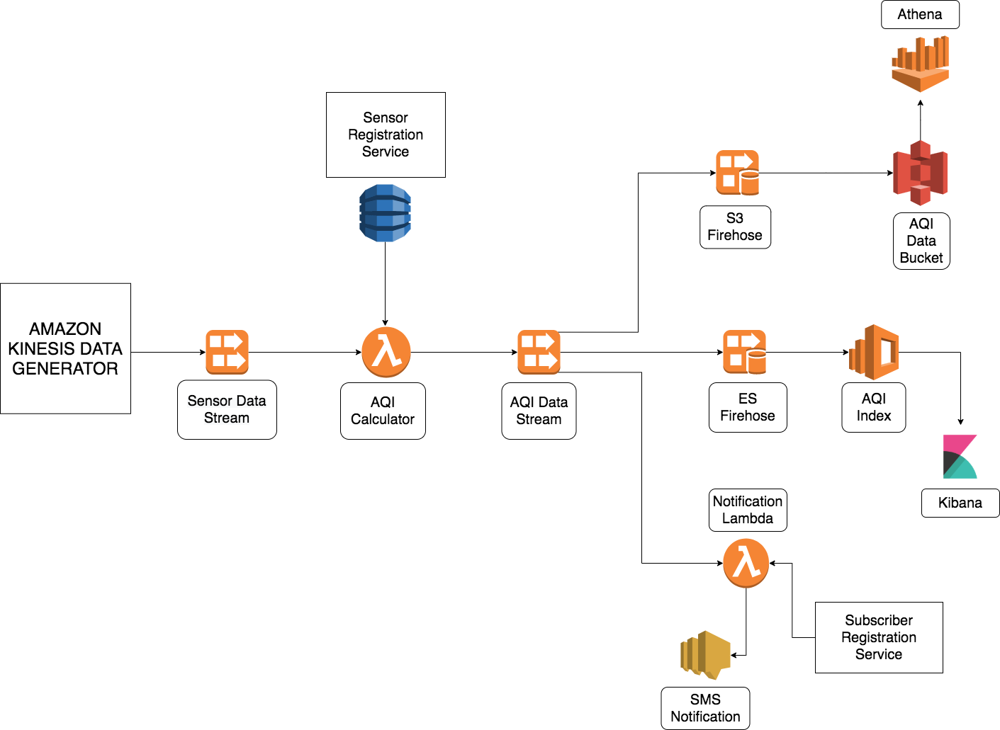
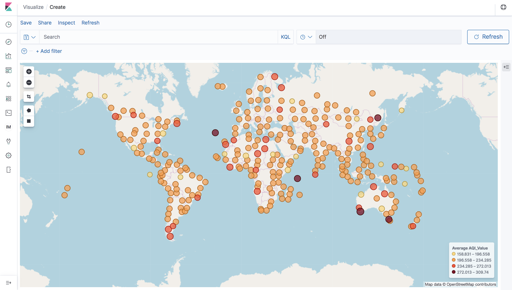
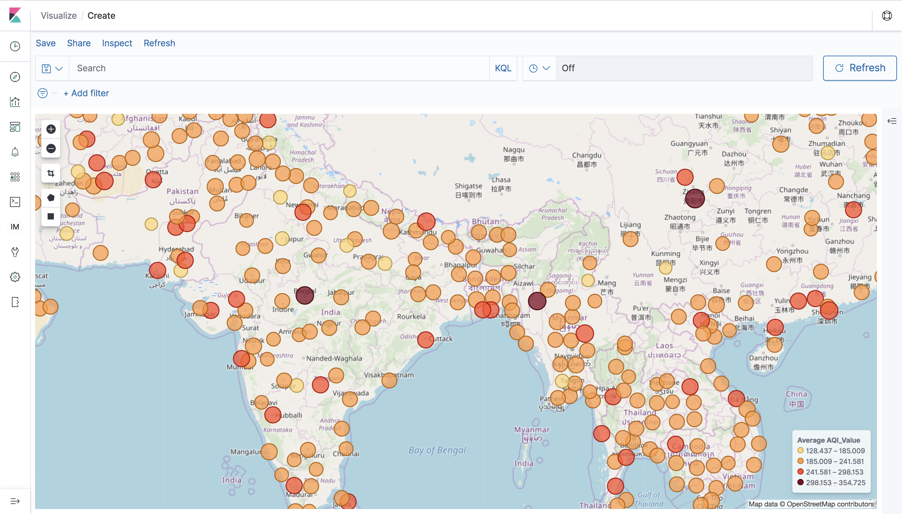
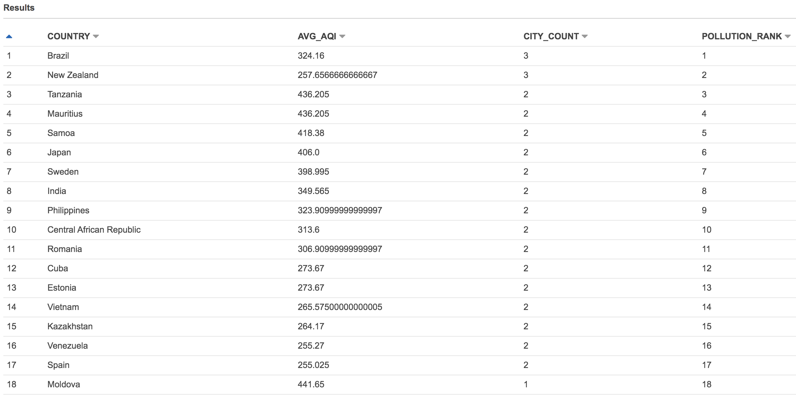

# AirLive
Real-Time Air Quality Notification System 

# About
There is so much increase in pollution levels over the years due to urbanisation, industrialization, global warming etc. Off late, I was really concerned about forest wildfires in California, that stuck to my brain why not create a real time air quality notification system. I built location aware real time Air Quality notification system where users get notified when pollutants have crossed the AQI limit to stay safe indoors.


AIR QUALITY INDEX (AQI) metric is calcluated using the formula shown below and there are 6 categories of AIR according to the calculated AQI  value.


# Data Pipeline



# Technologies Used
 - Data Source
	 - Simulated Real Time Air Quality Data using Kinesis Data Generator
 - Ingestion
	 - AWS Kinesis
 - Sensor Registration Service
	 - Dynamo DB
 - Processing 
	 - AWS Lambda (AQI Calculator, Notification Lambda)
 - Database
	 - AWS Elastic Search 
 - UI (Real Time Visualization)
	 - Kibana
 - SMS Notification (Real time Alerting)
	 - AWS SNS
 - Storage
     - AWS S3 
 - Batch querying
 	 - AWS Athena

# Workflow

Built a location aware real time air quality notification system by ingesting sensor data to Kinesis coming from
10,000 cities spread globally at 5000 tps.

Calculated AQI metric in real time for the incoming messages from Kinesis and split my pipeline into 3 different customers so that in future if one wants to add one more feature that is a new customer he can directly add it to my pipeline by talking to the second kinesis stream.
 
The three components are real time visualisation,real time alerting and batch querying.

Performed real time visualization with Kibana to show air quality across the globe.

Notified users in cities using geo queries on elastic search to stay safe indoors from the hazardous environment when pollutant levels have crossed the AQI limit. 

Dumped the data in S3 bucket so that using Athena 

#### Real-Time AQI Index ElasticSearch Mapping
```
{
  "aqi-es" : {
    "mappings" : {
      "properties" : {
        "AQI_Category" : {
          "type" : "text"
        },
        "AQI_Value" : {
          "type" : "float"
        },
        "CO" : {
          "type" : "float"
        },
        "NO2" : {
          "type" : "float"
        },
        "O3" : {
          "type" : "float"
        },
        "PM10" : {
          "type" : "float"
        },
        "PM25" : {
          "type" : "float"
        },
        "SO2" : {
          "type" : "float"
        },
        "StationID" : {
          "type" : "integer"
        },
        "city" : {
          "type" : "text",
          "fields" : {
            "keyword" : {
              "type" : "keyword",
              "ignore_above" : 256
            }
          }
        },
        "country" : {
          "type" : "text",
          "fields" : {
            "keyword" : {
              "type" : "keyword",
              "ignore_above" : 256
            }
          }
        },
        "location" : {
          "type" : "geo_point"
        }
      }
    }
  }
}
```

#### Subscriber Index ElasticSearch Mapping
```
{
  "subscriber-index" : {
    "mappings" : {
      "properties" : {
        "location" : {
          "type" : "geo_point"
        },
        "mobile" : {
          "type" : "text"
        }
      }
    }
  }
}

```

# Real time Visualization


Here we have geo hash map encoding the AQI value, let's zoom in to see the AQI density across the globe.





# Real time Alerting

I have a subscriber who is in the vicinity of a hazardous city who will be getting notification soon. For demo purpose, I am the subscriber registered to subscriber registration service with my mobile number. I will be getting notfication alerting regarding AQI category and AQI value.


# Batch querying
We have our batch data saved in S3 crawled using glue crawlers which creates glue catalog tables, we can use Athena to 
do SQL type querying on these glue tables, which is super powerful for all our batch needs. Below are some sample
queries:  

#### Select ALL Athena query

```
SELECT * 
FROM "aqi_batch"."aqi_batch_consumer_bucket"
limit 10

```

Response


#### Most Polluted countries ranked by Number of cities with AQI in Hazardous + Average AQI for those cities

```
SELECT COUNTRY, AVG_AQI, CITY_COUNT, ROW_NUMBER() OVER(ORDER BY city_count DESC,avg_aqi DESC) POLLUTION_RANK
FROM
(SELECT COUNTRY,avg(aqi_value) as AVG_AQI, COUNT(city) as CITY_COUNT
FROM "aqi_batch"."aqi_batch_consumer_bucket"
WHERE aqi_category IN ('Hazardous', 'Very Unhealthy')
GROUP BY country
ORDER BY city_count desc)
ORDER BY POLLUTION_RANK

```

Result:
